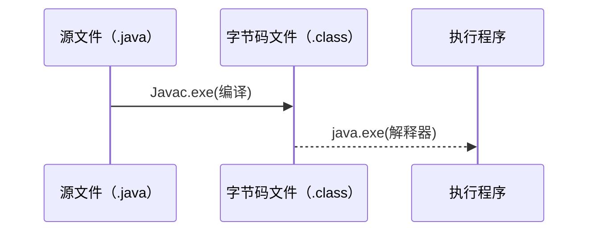

@[TOC](Java基础语法及面向对象)

# 1. java基础语法
## 1.1 java语言概述
### 1.1.1Java语言特点
1. 跨平台性
2. 面向对象思想
3. 简单性（省去了c++中的指针，多重继承）
4. 健壮性（鲁棒性  有垃圾回收机制，异常处理机制）
5. 多线程（提高了执行性能，安全问题）
6. 大数据开发？


###  1.1.2 JVM,JDK,JRE
#### 1.1.2.1 JVM
- JVM：(Java Virtual Machine)java虚拟机，会在内存中开辟一块空间，将源文件.java编译成计算机可识别的字节码文件.class;
- 字节码文件再解释成机器码运行。解释是通过Java虚拟机来执行的。字节码文件不面向任何具体平台，只面向虚拟机。因而java语言具有平台无关性。
- 
- 源文件（.java）------>编译器编译（JVM）-->字节码文件（.class）


- 内存：通过地址来寻找，临时执行使用的
- 硬盘：扇区来转动寻找，永久性的保存。
#### 1.1.2.2 JRE
- JRE:Java Runtime Environment 运行环境 可以运行.class
#### 1.1.2.3 JDK
- JDK：Java Development Kit  java开发工具包
- javac.exe(编译，形成字节码文件)    java.exe (执行字节码文件，运行时)


### 1.1.3 数据类型
#### 1.1.3.1 基本数据类型
类型  	 | 数据类型 	|占字节数	 | 位数
--------   | -----		    |	----- 		 | -----
整型	    |   byte         | 1  	         |  8
&nbsp;	|   short        | 2  	         |  16
&nbsp;	|   int            | 4  	         |  32
&nbsp;	|    long        | 8  	         |  64
浮点型 |   float         | 4  	         |  32
&nbsp;	|   double     |  8	         |  64
字符型 |   char         | 2  	         |  16
boolean型 |boolean | 1/8  	         |  1
- 取值范围：例：byte 8bit 但是最高位是符号位（0--正数  1--负数） 剩余 7位表示数值范围 -2^7 ~  2^7-1  (-128~127)
- float:0 000000000.0000 0000 0000 0000 0000 00(最高位符号位，9位表示正数，小数点后面表示小数)  double（19位表示正数数值）
- boolean 只能取 true false 且不可以和其他数据类型强制转换
#### 1.1.3.2 引用数据类型
- 数组 class interface enum 注解 String……
- 基本数据类型可以通过封箱变成他们对应的引用数据类型
### 1.1.4常量与变量
#### 1.1.4.1常量
- 常量：固定不变的，在程序的过程中不会发生变化（1.代表计算中国经常用到的值PI，用来代表一个含义 public   static final  LEFT=true）
- 所有的基本数据类型都可以为常量 只要存放的地址空间的不在改变
#### 1.1.4.2 变量
- 变量：值内存空间，内存空间存放的值可以改变，变量空间在创建时，必须指定数据类型，变量空间的名字，变量空间只能存放一个内容，且变量空间的内容可以改变 
- 定义： 数据类型 变量名
- 空的变量空间不能使用，会编译错误;（全局变量会有默认值，局部变量没有默认值）
- int x;x=1;(计算机底层：1、x 变量空间 存储在栈中；2、1常量存储在常量池；3、把1赋复制一份再放在 x 空间中)

1. 在硬盘上创建一个 java源文件 Test.java
2. 将Test.java 编译成字节码 Test.class文件
3. classLoader类加载器硬盘将Test.class加载到内存
4. java Test指令 运行的是加载到方法区的类模板Test上的信息，并不是Test.class字节码文件
5. 1 存放在常量池中，int x=1;将1的值复制放在x空间中；（int x=1;int y=x;将x空间的值赋值给y）
### 1.1.5数据类型之间的转换
```java
byte a=1; int b=a;//把小容量的放在容量较大的中可以
/*
1.同种数据类型之间可以直接进行赋值
2.不同种数据类型之间 转化 需要装箱 拆箱过程 
*/
int a=10000;byte b=a;//将数值较大的放在较小的里面，可以通过，但是赋值之后，值会发生改变，因为小容器装不下
int a=1;float b=a; //整型与浮点数比较精确度，精确度小的可以直接赋值给精确度较大的。
float a=1.9F;int b=(int)a;//采用去掉小数点后面而不是四舍五入的方法，去强制类型转化
char c='a'; int y=c;//char转int 型，会把char对应的Unicode编码对应的数字赋值给int 默认转化
int x=97;char y=(char)x;//容量大的变小的需要强转

```
**boolean不能与其他类型转化**

### 1.1.6java运算符
- 运算符：用来指明对于操作数的运算方式，可以按照操作数数目来划分（单目，双目，三目），可以按其功能来分（算术运算符，赋值运算符，关系运算符，逻辑运算符，位运算符）
#### 1.1.6.1算术运算符
- 单目：~（按位取反）、! (取非)、-（负号运算符）、 ++（自增）、 - -（自减）
```java
 int x=1;
 int y=x++;//将x变量空间的值先取出放在副本空间，在x++,在将副本的值放入y中
```
1. int x=1;
2. 临时空间X' X'=1
3. x 自增 x==>2
4. int y=x;从副本空间赋值  y==>1
5. 临时空间销毁


eg1:
int m=1;
int n=2;
int sum=m++++n-n-----m+n-----m;
答：
m=1;//210
n=2;//321
         1      +     3  -  3 -  1    + 2   -  0 
sum=m++ + ++n - n-- - --m + n-- - --m=2

eg2:
int a=1;
for(int i=0;i<1000;i++){
	a=a++;//int a=1 -->临时备份为1  --> a++  -->临时备份赋值得a
	//++a 先自增 在备份    a++ 先备份在自增
}
结果：a=1
- 双目：+ - * / %（取余）
 - 三目：a>b?true:false 说明：当a大于b的时候，为true（也就是冒号之前的值），否则为false；这整个运算符包括一个关系运算符（可以是“>”"<""!="等等），一个“？”，一个“：”，冒号前后需要有两个表达式或者是值或者是对象。
 - 
#### 1.1.6.2关系运算符
等于符号:==，不等于符号:!= ，大于符号:>， 小于符号:<，大于等于符号:>= ，小于等于符号:<= 。
位与逻辑
#### 1.1.6.3位运算符
- 位运算符　与（&）、非（~）、或（|）、异或（^）<<  >>  >>>(按位右位移 无符号)
- &：双目运算符，运算时均把运算数转换为二进制再做比较，规则：当相同的位上均为1时结果为1，否则为0.如：1010&1101，转为二进制：1111110010&10001001101，比较结果为：1000000转为十进制： 64。所以1010&1101=64；
eg1:     3     &    5
 ……0011   & ……0101
        …… 0001
- | ：当两边操作数的位有一边为1时，结果为1，否则为0。如1100|1010=1110
- ~：0变1,1变0
- ^：两边的位不同时，结果为1，否则为0.如1100^1010=0110
- <<按位左位移：<<1 相当于 *2       <<n  相当于 X2^n
- “>>”:按位右位移：>>n 相当于  /2^n
- 无符号按位有位移>>>：当为值为-6 （1、 -6>>1时最高符号位不够时添1 ；2、-6>>>1 最高位不管是啥都填0 )
- **^**:异或 不同为1 相同为0
eg1:**交换两个数的方法3种**
```java
        int a=1;
        int b=2;
        //交换 a b值的三种方法
        //1.利用辅助空间（易于理解，但浪费了空间）
        int temp=a;
        a=b;
        b=temp;
        System.out.println("a:"+a);
        System.out.println("b:"+b);
        
        //2.利用a+b的和差来进行(不会利用辅助空间，但是a+b可能会溢出)
        a=a+b;//a=a+b
        b=a-b;//b-->a
        a=a-b;//a-b(a)  a-->b
        System.out.println("a:"+a);
        System.out.println("b:"+b);
        
        //3.利用一个数与同一个数进行两次亦或，则不变
        a=a^b;//001 ^ 010 =011
        b=a^b;//011 ^ 010 =001
        a=a^b;//011 ^ 001= 010
        System.out.println("a:"+a);
        System.out.println("b:"+b);

```
**>> <<**:
eg2:计算2*8的最有效的方法  2>>3
#### 1.1.6.4逻辑运算符
- 短路与（&&）、非（!）、短路或（||） （逻辑与）&   （逻辑或）|
##### 1.1.6.4.1 || 与 | 区别
**==| 与 | 区别==**
- ||短路或：当||之前有条件为true时，后面的条件不在执行
- | 逻辑或 ：不算|之前有没有条件为true，| 后面的都要执行
- || 只有在|| 前有条件为true 时，才会性能比 | 好

##### 1.1.6.4.2 
**==&&与 & 区别==**
- &&短路与：当&&之前有条件为false时，后面的条件不在执行
- &逻辑与 ：不算|之前有没有条件为false，& 后面的都要执行
- && 只有在&& 前有条件为false时，才会性能比 & 好

- 对象instanceof 类（接口） 双目运算符，该运算符运算结果是true，否则是false。

#### 1.1.6.5赋值运算符
- = += -= *= /= %= &= ^= |= <<= >>=
##### 1.1.6.5.1 x+=y与x=x+y区别
**==x+=y与x=x+y区别==**
```java
//1.当x,y两个数据变量相同时,没有太大区别
       int a=1;
        a+=2;//a--->3
        int b=1;
        b=b+2;//b--->3

        System.out.println("a:"+a);
        System.out.println("b:"+b);
//2.当x,y两个数据变量不相同时

        byte x=1;
        x+=2;//x-->3
        /*
        += :1.是一个赋值运算符，x空间为byte类型8 bit  ,2为 32bit
            2.x+=2 根据+会将x的自动提升为32 bit
            3.得到的32 bit的结果通过“=”在自动转化成byte类型
         */
        x=x+2;//Error:java: 不兼容的类型: 从int转换到byte可能会有损失
        /*
         x=x+2:1.有两个操作符组成
               2.x为byte 2为32bit
               3.结果为32bit 通过 “=” 赋值给 空间类型为byte 会编译错误（因为此时=的不确定性，它仅仅只是一个赋值语句）
               4.所以要从一个32bit赋值给一个 类型为8bit的空间 需要强制类型转换 x=(byte)(x+2);
         */

```
